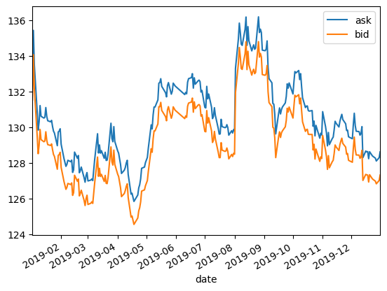

# Web-Scrapping using Beautifulsoup

Projek ini merupakan fork dari projek capstone dari Algoritma Academy Data Analytics Specialization.

Aplikasi ini bertujuan untuk mengambil data kurs [Japan Yen](monexnews.com/kurs-valuta-asing.htm?kurs=JPY).

## Dependencies

- beautifulSoup4
- pandas
- flask
- matplotlib

## Cara menjalankan aplikasi

1. Clone this app

2. run the app using with `python app.py`

## Hasil data

## Kesimpulan

Terjadi penurunan kurs JPY jika dibandingkan awal hingga akhir tahun
